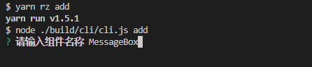
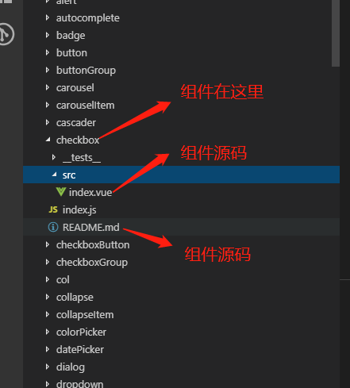
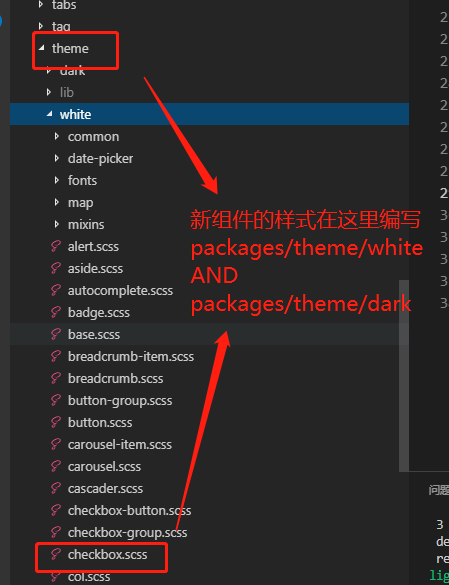
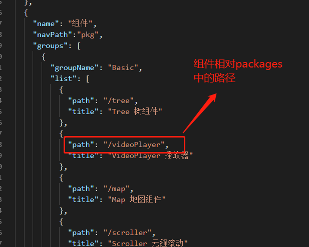

### SenseTime 基础组件库 ✌️

本地搭建开发环境：

```s
git clone git@gitlab.sz.sensetime.com:scg-iva-bpl/open-source/razor.git -b cli

yarn

yarn add gulp global (如果本地没有gulp 需要执行这一步)

yarn dev:start（第一次跑）

yarn dev（后续使用）
```

项目依赖安装完成后，运行命令行以添加新的组件:

```s
yarn rz add
```

填写组件名称



为了统一，我们使用小驼峰命名来组合名字，如 `'messageBox'` 实际使用会是 rz-message-box

命令运行完毕之后会在 `packages` 文件夹下生成一个对应的文件夹:





按要求在 `doc/src/nav.config.json` 中填写新的组件即可预览组件文档, 具体例子参考 `packages/button`:


