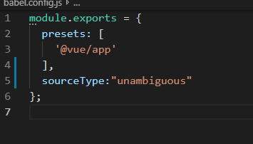
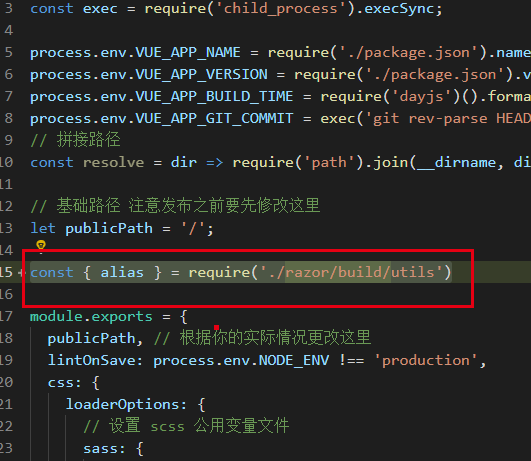

# 安装指南
-----------
## submodule 形式使用 Razor
---------------
### Webpack 4 版本 Submodule 形式集成 Razor 
#### (1) git submodule
```s
  1.	 git submodule add  razor的git repo 地址       (第一次)
  2.	 git submodule init 
  3.	 git submodule update
```
#### (2) config 
```s
  1.	删除razor 中的package.json
  2.	并在razor中的tsconfig.json 的exclude 中添加 "**/__tests__/*.ts"
```
#### (3) 项目中安装依赖
```s
  1.	yarn
  2.	yarn run  => your scripts
```

---------------

### Vue-Cli3 版本
#### 开始工程
1. vue create app（你的工程名字）
2. 自定义配置
3. 选中 babel typescript  router vuex
4. 不选中lint（若有需求，需要根据实际情况调整忽略Razor的代码，因为不同项目的lint配置不同）
5. 其他选择yes

#### (1)git submodule
1.	 git submodule add  razor的git repo 地址          (第一次)
2.	 git submodule init 
3.	 git submodule update
#### (2) 项目根目录的babel.config.js 中添加 配置 如图


##### sourceType: umabiguous

#### (3) 在vue.config.js 中添加如下配置

 
1. const { alias } = require('./razor/build/utils')
2. 设置 alias:
    (1) Object.keys(alias).forEach(key => config.resolve.alias.set(key, alias[key]))

#### (4) 安装工程依赖
1. 找到razor的package.json ,与现有工程不同的依赖都需要装到这个新起的项目中

#### (5) 在项目中import razor 组件
import razor from "pkg/index.js"
Vue.use(Razor)
 
#### (6) 引用样式规则
import "../razor/packages/theme/white/index.scss"
<!-- 然后在样式变量文件中复写上面两个变量 -->

#### (7) tsconfig.json 配置
设置 "noImplicitAny": false,

#### (8) 开始开发
yarn serve

---------------

## NPM 安装指南
在项目根目录中新建.npmrc 文件,并在.npmrc 文件中添加内容

```code
  @sensetime:registry=http://npm.sz.sensetime.com
  sass_binary_site=https://npm.taobao.org/mirrors/node-sass/
  phantomjs_cdnurl=https://npm.taobao.org/mirrors/phantomjs/
  electron_mirror=https://npm.taobao.org/mirrors/electron/
  registry=http://10.111.32.60:10080
```

执行安装
```code
  yarn add @sensetime/razor
```
